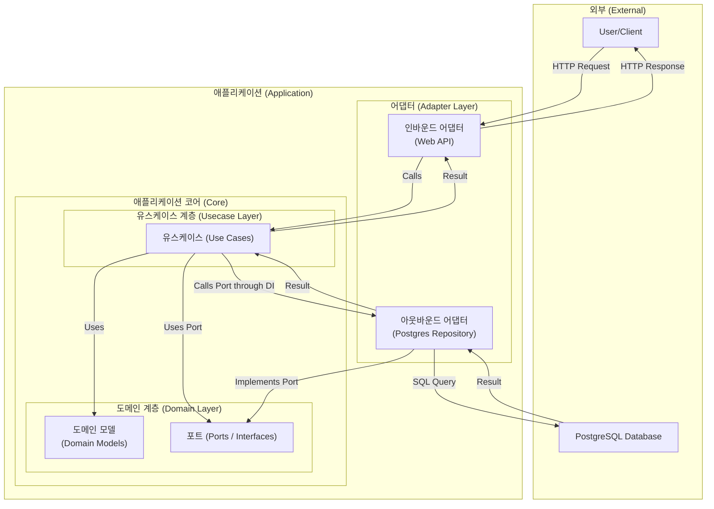

## 브랜치 이름 컨벤션
다음과 같이 작성해주세요.
- ex) feat/#1 (이슈 번호)

## 라이브러리
- 문서화: `swag`
- 서버: `fiber`
- 데이터베이스: `sqlc`
- 테스트: `testify`
- 로깅: `zerolog`
- 의존성 주입: `samber/do` (v2)
- 데이터베이스 마이그레이션: `dbmate`

## 환경 변수 예제 (`.env`)
```env
PORT=8080

POSTGRES_HOST=localhost
POSTGRES_PORT=5432
POSTGRES_USER=postgres
POSTGRES_PASSWORD=postgres
POSTGRES_DB=smartfarm

# Google AI API
GOOGLE_AI_API_KEY=your_gemini_api_key_here
```

## Architecture

